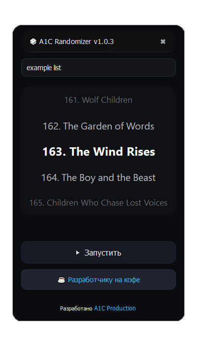

<h1 align="center">🎲 A1C Randomizer</h1>

<p align="center">
  
</p>

**Поддерживаемые ОС:** Windows 7 SP1 / 8 / 8.1 / 10 / 11  
**Разработчик:** A1ekin для [A1C Production](http://a1cprod.ru)  

A1C Randomizer — удобный визуальный инструмент для случайного выбора элементов из списка.  
Программа идеально подходит для выбора фильмов, игр, задач, дел или любых других элементов, которые вы хотите «рандомизировать».

---

## 1. Установка и запуск

- Скачайте актуальную версию со [страницы релизов](https://github.com/A1ekin/A1C-Randomizer/releases).  

- Убедитесь, что рядом с `randomizer.exe` находится хотя бы один `.cfg` файл со списком элементов.  
  В архиве есть пример файла: `example list.cfg`.

- Запустите `randomizer.exe` двойным кликом.  
  Программа откроется в окне с современным дизайном.

---

## 2. Интерфейс программы

<table>
  <tr>
	<td>

### 2.1 Панель заголовка
- Показывает название программы: 🎲 A1C Randomizer v1.0.3  
- Кнопка закрытия: ✖  
- Окно можно перемещать, зажав левую кнопку мыши на панели заголовка

### 2.2 Выбор файла со списком
- Выпадающий список `.cfg` файлов из текущей папки  
- Программа автоматически загружает первый найденный файл  
- Если файлов нет, кнопка запуска отключена

### 2.3 Список элементов
- Центрируется на «активном» элементе  
- Список дублируется несколько раз для создания эффекта рулетки  
- Прокрутка вручную отключена (колёсико мыши и клавиши вверх/вниз не работают)

### 2.4 Кнопка запуска (▶ Запустить)
- Запускает «рулетку» случайного выбора элемента  
- После завершения анимации выбранный элемент оказывается в центре

### 2.5 Кнопка доната (☕ Разработчику на кофе)
- Открывает ссылку: [https://boosty.to/a1ekin/donate](https://boosty.to/a1ekin/donate)

### 2.6 Справка и авторские ссылки
- Внизу окна есть ссылка на сайт A1C Production: [http://a1cprod.ru](http://a1cprod.ru)

    </td>
    <td>
      
    </td>

  </tr>
</table>

---

## 3. Формат `.cfg` файла

- Каждый элемент списка — на новой строке  
- Пустые строки игнорируются  

**Пример `example list.cfg`:**
```
			1. The Lord of the Rings
			2. Breaking Bad
			3. The Witcher
			4. Game of Thrones
			5. Stranger Things
			...
			200. How to Train Your Dragon: The Hidden World
```

- Максимальная длина списка не ограничена, но большие списки могут немного замедлить анимацию

---

## 4. Принцип работы

1. При загрузке файла список дублируется несколько раз для создания визуальной рулетки  

2. При нажатии ▶ Запустить:
   - Выбирается случайный элемент  
   - Список плавно прокручивается анимацией с эффектом ускорения и замедления  
   - В конце выбранный элемент оказывается точно в центре видимой области  

3. Если список пустой или файл не найден, отображается соответствующее сообщение

---

## 5. Горячие клавиши

- **Alt + Shift + Enter** — мгновенный запуск случайного выбора (аналог кнопки ▶ Запустить). Даже если окно программы не в фокусе (послезно на двух мониторах во время игры или при стриминге).

---

## 6. Примеры применения

1. **Случайный фильм на вечер** — быстро выбирайте, что смотреть из вашей коллекции фильмов или сериалов.  
2. **Выбор задачи из списка дел** — пусть программа решает, с чего начать рабочий день.  
3. **Игра с друзьями** — кто первым выполнит задание, выбирает номер, персонажа или карту.  
4. **Рандомизация персонажей для настольных RPG** — идеально для D&D, Pathfinder и других ролевых игр.  
5. **Случайный выбор игры для вечера** — определитесь, во что играть, из всех установленных игр.  
6. **Генерация случайного рецепта** — выбирайте, что готовить на ужин, из заранее составленного списка.  
7. **Выбор подарка** — программа поможет случайным образом выбрать подарок для друга или коллеги.  
8. **Рандомизация упражнений или тренировок** — создайте список тренировок и дайте программе выбрать, что делать сегодня.  
9. **Случайный герой в видеоигре** — полезно, если играете в команде и хотите добавить элемент неожиданности.  
10. **Образовательные игры** — выбирать случайный вопрос, тему для изучения или книгу из списка.  

И многое другое — ограничений нет, всё зависит только от вашей фантазии и целей!


---

## 7. Возможные ошибки

| Ошибка                     | Причина                               | Решение |
|-----------------------------|---------------------------------------|---------|
| `(файл не найден)`          | Файл отсутствует или удалён           | Поместите файл `.cfg` рядом с `exe` и перезапустите приложение |
| `(файл пуст)`               | В файле нет строк                      | Добавьте элементы в `.cfg` файл, каждый на новой строке |
| `Ошибка чтения файла: ...`  | Неправильная кодировка или доступ к файлу | Проверьте кодировку UTF-8 и права доступа |

